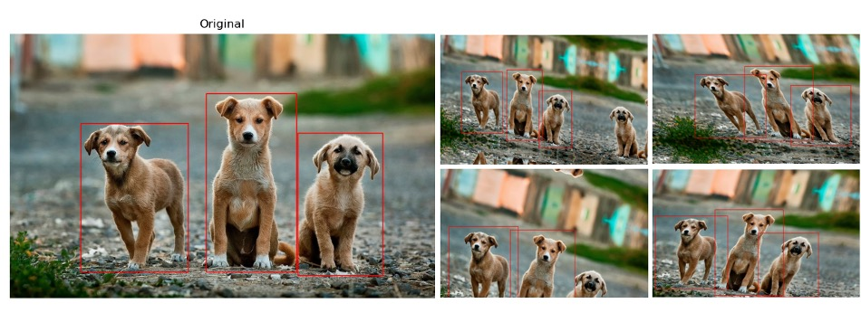

# image-augmentations
Simple function for generating affine geometric augmentations on images and (possible) bounding boxes within them. It can be used to augment image datasets and generate as many variations from a single image, as you want.



- **augment_affine()**: Generates multiple affine variations of an input image, while adjusting any existing bounding boxes within it.
      Main parameters:
      - **bboxes**: List of bounding boxes inside the image (can be None)
      - **how_many**: how many augmentations to generate per image (number)
      - **range_scale**: range of values for scaling (percentage)
      - **range_translation**: range of values for xy translation (in pixels)
      - **range_rotation**: range of values for rotation (in degrees)
      - **range_sheer**: range of values for sheer (in degrees)
        

# Contents:
```tree
├── source                         [Directory: Source code]
│   ├── augmentations.py           [Main script with all the functions]  
│   └── test_augmentation.py       [Example for testing augmentations]
└── images                         [Directory: Sample test images]
```

# Dependences
- numpy
- skimage
- matplotlib
